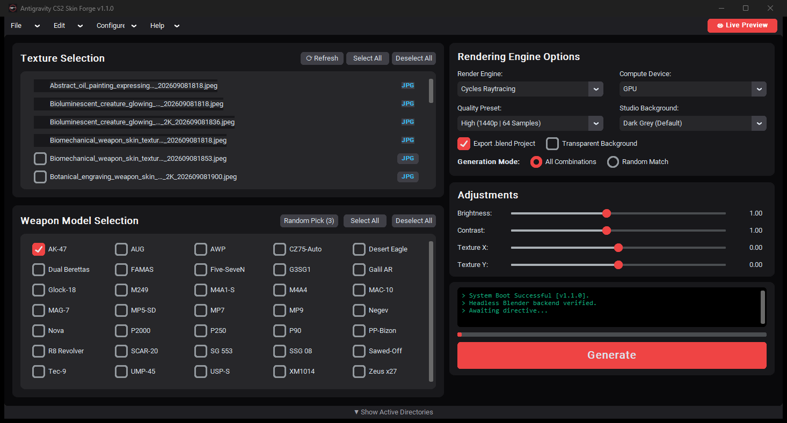
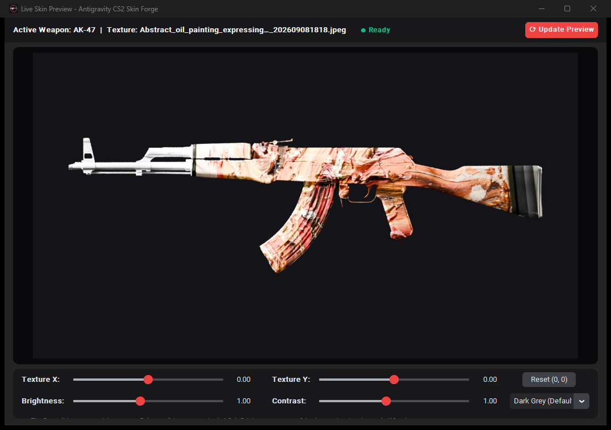
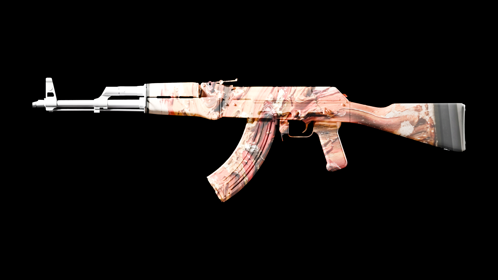
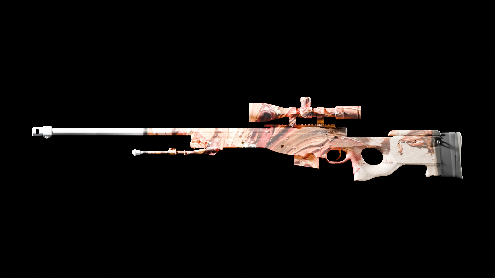
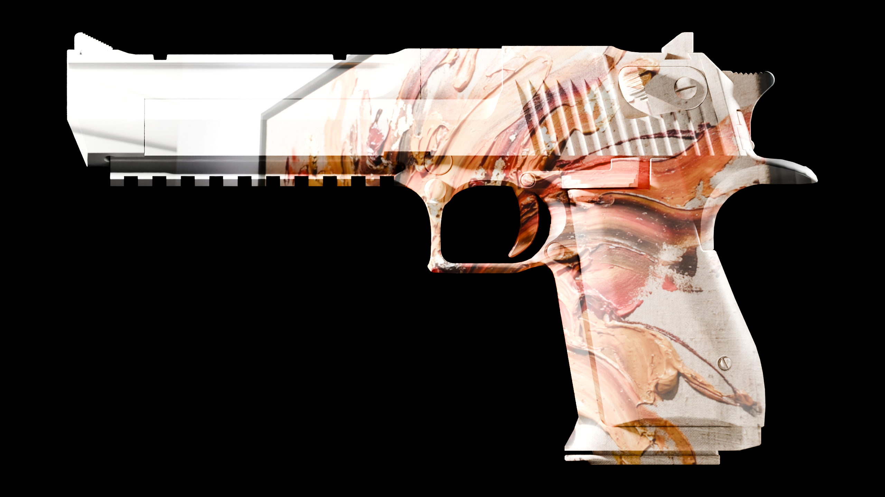
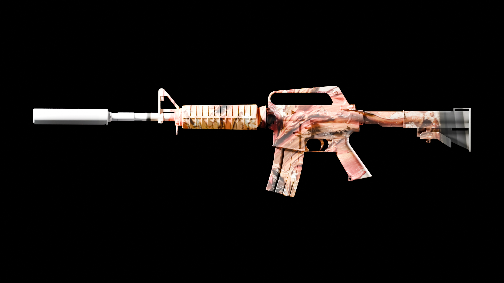

<div align="center">
  
# Antigravity CS2 Skin Forge 🔫🎨

**An automated, headless Python pipeline for generating photorealistic Counter-Strike 2 weapon skins using Blender's CYCLES & EEVEE engines.**

[](https://github.com/Smokianlord/Antigravity-CS2-Skin-Forge/releases/tag/v1.1.0)
[](https://opensource.org/licenses/MIT)
[](https://www.python.org/downloads/)
[](https://www.blender.org/)
[](https://github.com/TomSchimansky/CustomTkinter)

<br>

<p align="center">
  
</p>

</div>

## 📖 Description

**Antigravity CS2 Skin Forge** (version **v1.1.0**), created by **Smokianlord**, is a professional-grade UI and rendering pipeline built specifically for Counter-Strike 2 skin creators, workshop designers, and 3D artists. It completely automates the process of mapping 2D pattern textures onto 3D CS2 weapon models, framing them using mathematical bounding-box orthographic cameras, rendering them through headless Blender (Cycles / Eevee) with studio PBR materials, post-processing them in real time, and exporting production-ready showcases and `.blend` project files in batch.

---

## 👁️ Dedicated Large Live Preview Window (1060×720)

Clicking **`👁 Live Preview`** on the top ribbon bar launches a dedicated high-resolution studio with a large **960×540** 16:9 viewport.

<p align="center">
  
</p>

- **Real-Time Texture Movement**: Slide your pattern horizontally (**Texture X**) and vertically (**Texture Y**) across the weapon geometry.
- **Natural Coordinate Inversion**: Inverted mapping location offsets ensure moving sliders right moves textures right, and sliders up moves textures up.
- **Auto-Render on Slider Release**: Letting go of the mouse button auto-renders the preview in **~1.3–1.8 seconds**.
- **Instant PIL Compositing (<10ms)**: Adjusting `Brightness`, `Contrast`, `Studio Background`, or `Transparent Background` updates the preview canvas instantly via PIL without re-rendering in Blender.
- **Direct Switchers & Reset**: Switch active weapon models and textures directly in the preview header, or click **Reset (0, 0)** to snap back to default center.

---

## 🖼️ Showcase Gallery (Rendered via Headless Cycles Raytracing)

| AK-47 Showcase | AWP Showcase |
| :---: | :---: |
|  |  |
| **Desert Eagle Showcase** | **M4A1-S Showcase** |
|  |  |

---

## ✨ Key Features

- **All 35 CS2 Weapons Included**: 3D OBJ weapon models are bundled directly inside the standalone executable and organized cleanly in `Assets/Models`.
- **Dedicated Live Preview Window (1060x720)**: Large 960x540 viewport with real-time Texture X & Texture Y positioning sliders.
- **Headless Blender Integration**: Directly interfaces with Blender (CYCLES/EEVEE) in the background without needing to open the software.
- **Smart Framing & Alignment**: Uses global bounding-box math and orthographic scales to perfectly frame any weapon size, from a Glock to an AWP, at consistent scales.
- **Auto-Material Generation**: Automatically extracts and injects official Valve CS2 normal and roughness maps into the node tree.
- **Batch Processing**: Render hundreds of weapon-texture permutations automatically ("All Combinations" or "Random Match").
- **Dynamic Environments**: 3 unique lighting presets (Studio Pro, Bright Flat, Dark Cinematic) and 5 dynamic background compositions (Dark Grey, Deep Blue, Pure White, Pure Black, Green Screen).
- **Post-Processing**: Built-in Brightness and Contrast slider integration via Python `PIL.ImageEnhance`.
- **Slide-up Folder Drawer**: Bottom bar with one-click copyable directory paths for easy file management.

---

## 🛠️ Installation

### 1. Prerequisites
You must have the following software installed:
* [Python 3.10+](https://www.python.org/downloads/)
* [Blender](https://www.blender.org/download/) (Installed via Steam at `C:\Program Files (x86)\Steam\steamapps\common\Blender\blender.exe` or automatically discovered across standard system paths)

### 2. Clone the Repository
```bash
git clone https://github.com/Smokianlord/Antigravity-CS2-Skin-Forge.git
cd Antigravity-CS2-Skin-Forge
```

### 3. Install Dependencies
```bash
pip install -r requirements.txt
```

*(Required packages: `customtkinter`, `Pillow`, `numpy`)*

---

## 🚀 Usage

### Option A: Running the Standalone Executable (.exe)
Download or double-click `Antigravity CS2 Skin Forge.exe`. The 35 official weapon models are bundled directly inside the executable, so it runs completely out of the box!

### Option B: Running from Python Source
```bash
python gui_app.py
```

### Compiling to a Standalone Executable (.exe)
To compile a standalone `.exe` with the weapon models bundled inside:
```bash
pyinstaller --onefile --noconsole --name "Antigravity CS2 Skin Forge" --icon="icon.ico" --add-data "icon.ico;." --add-data "Assets/Models;Assets/Models" --version-file=version.txt gui_app.py
```

### Workflow
1. Place your exported flat `.jpg` or `.png` textures into the `Input_Textures` directory (or click **⟳ Refresh** to reload textures while the app is running).
2. Launch the application.
3. Select the textures you want from the **Texture Selection** checklist.
4. Select the weapons you want to render from the **Weapon Model Selection** grid.
5. Click **`👁 Live Preview`** in the top ribbon bar to open the large preview viewport. Adjust **Texture X** and **Texture Y** to position the skin exactly where you want it.
6. Configure Render Engine (CYCLES GPU recommended), Quality Preset, Background, and Post-Processing.
7. Click **Generate** and monitor progress in the live terminal console.

---

## 📂 Directory Structure

```text
Antigravity-CS2-Skin-Forge/
│
├── "Antigravity CS2 Skin Forge.exe"  # Standalone compiled executable (all models bundled)
├── gui_app.py                       # Main CustomTkinter application and logic
├── blender_headless_render.py       # Headless Blender execution script
├── requirements.txt                 # Python dependencies
├── version.txt                      # Windows Executable metadata for PyInstaller
├── icon.ico                         # Application crosshair icon
├── CHAT_AND_DEVELOPMENT_LOG.md      # Full chronological project history & changelog
│
├── docs/                            # Documentation and media
│   └── images/                      # App screenshots & weapon showcases
│       ├── app_interface.png        # Main GUI preview
│       ├── live_preview_window.png  # Dedicated Live Preview Studio screenshot
│       └── showcase_*.png           # Photorealistic weapon renders
│
├── Input_Textures/                  # Drop your custom weapon textures here
├── Output_Renders/                  # Rendered showcases appear here
├── Output_Project_Files/            # Automatically saved .blend projects
│
└── Assets/                          # Fully self-contained local assets
    ├── Models/                      # All 35 official weapon .obj models
    └── Textures/                    # Valve CS2 normal & roughness maps
```

---

## 🔧 Configuration

Blender is automatically discovered on your system (Steam paths, standard installation directories, and system PATH). You can also configure a custom Blender executable path directly in the application via:
`Top Ribbon` -> `Configure` -> `Set Blender Executable Path`

---

## 🤝 Contributing

Contributions, issues, and feature requests are welcome! 
Feel free to open an issue or pull request.

1. Fork the Project
2. Create your Feature Branch (`git checkout -b feature/AmazingFeature`)
3. Commit your Changes (`git commit -m 'Add some AmazingFeature'`)
4. Push to the Branch (`git push origin feature/AmazingFeature`)
5. Open a Pull Request

---

## 📝 License

Distributed under the MIT License. See `LICENSE` for more information.

---

<div align="center">
  <i>Created with ❤️ by Smokianlord</i>
</div>
